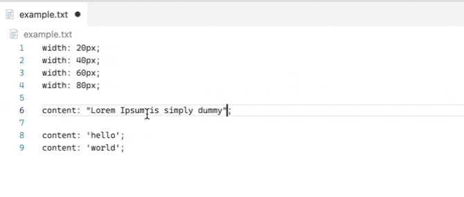

# 🛠 VSCode Selection Transformer

This VSCode extension allows you to transform your selections via an evaluated javascript expression.


---

## How to use

- Make selection

- `CTRL/CMD` + `P`

- Choose `Transform Selection`

- Enter expression, Press `enter`

> You can access the current selection in the variable `value` and is a string.

---

### Example:

```javascript
value
  .split(" ")
  .map((x) => `"{x}"`)
  .join(", ");
```



---

## Extension Settings

\-

## Known Issues

\-

## Release Notes

### 1.0.0

Initial release
